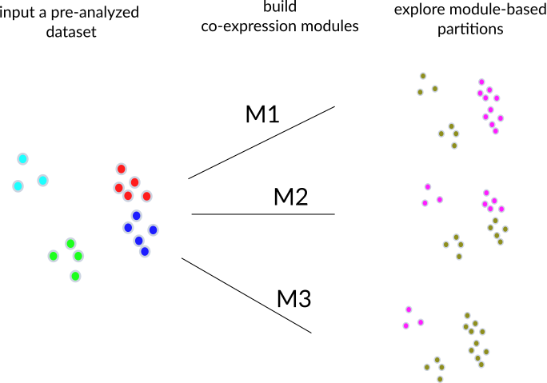

# Results

## The fcoex method 

The _fcoex_ tool was built bottom up from first principles, with a goal to avoid complicated algorithms and provide better understandability. 

Our first goal was to come up with a smaller set of genes that globally captured the cellular diversity of a dataset. 

Instead of using simply the highly variable genes, we decided to explore _symmetrical uncertainty_, a different correlation metric.

Symmetrical uncertainty was serendipitously chosen after initial observations of features selected after applying the FCBF algorithm to scRNA-seq data. 

FCBF, an acronym for "Fast Correlation Based Filter", is the name of a popular feature selection algorithm for machine learning (over 2700 Google Scholar citations) with little previous use in biomedical sciences (8 PubMed results for "FCBF" as of April 2021). 

Symmetrical uncertainty relies on entropy (in the information theory sense), which relies on categories for calculation.

Thus, we implemented in R a set of heuristics to binarize gene expressions (https://bioconductor.org/packages/release/bioc/html/FCBF.html) and allow
processing. 

Additionally, mutual information is a supervised method, meaning that before using it, we need to have labels for cells. 
These labels are obtained after running a standard clustering pipeline,  such as Seurat's (https://satijalab.org/seurat/articles/pbmc3k_tutorial.html) and convey information about the distribution of cells in the gene expression manifold. 

The first step of the pipeline uses a binarized gene expression matrix and preliminary labels to select a set of genes that _globally_ separates cells from each other. 

These global markers are not necessarily specific to any cluster; they might be specific to multiple clusters, but still provide information to tell them apart.

The selected features, however, share a degree of redundancy: some pairs of genes have virtually identical expression patterns. 

The FCBF feature selection is good at finding and removing that redundancy, what is good for some machine learning algorithms. 

We inverted the method to capture redundancy instead of removing so to identify gene coexpression modules and implemented the algorithm in the _fcoex_ package (see Methods for details).   

The gene coexpression modules yielded by the pipeline are small by design (10s of genes per module), so to facilitate manual exploration of the coexpression landscape.
Moreover, each module has one "header" gene, which expression pattern is most representative of the genes in the module. 

The ultimate goal of the _fcoex_ pipeline, though, is not necessarily the modules, but use them to find biologically relevant populations. 

Modules contain correlated and anti-correlated genes, and thus might held signatures for two different populations. 

To find those populations, fcoex treats each module as a gene set. It then uses only the expression of genes in the module to re-classify the cells.

After projecting the pipelines, we intende to verify if the modules captured different biological functions, and provide complementary views on cell identities to the ones provided by simply applying the Seurat clustering pipeline.

{#fig:overview height=7in .white}

## fcoex recovers multi-hierarchy of blood types

 To validate the fcoex pipeline, we selected the well-known pbmc3k dataset from SeuratData, which contains around 2700 peripheral blood mononuclear cells (PBMC) with author-defined cluster labels (Figure 2A). 
 The standard fcoex pipeline detected nine modules which, reassureingly, captured transcriptional pathways known to be active in different blood cells (Table A, SUPP FIGURE PBMC 3K). For example, module M8 contained cytotoxicity genes, as PRF1 and GZMA. 
 he reclustering based on M8 split the dataset into cytotoxic (NK + CD8) and non-cytotoxic cells (Figure 2 B-C).
 M7 (CD79A) cluster corresponded to B cells, while M5 (HLA-DRB1) grouped monocytes, B cells, and dendritic cells, all known antigen-presenting cells (APC) (https://www.ebi.ac.uk/ols/ontologies/cl/terms?obo_id=CL:0000145).
 Of note, the APC populations are apart in the UMAP (Uniform Manifold Approximation and Projection for dimensional reduction)(McInnes et al. 2018) representation (Figure 2D), even though the relevance of the class is known acknowledged  similarity might have gone unnoticed in the single-cell analysis without fcoex.
 In general, fcoex clusters are combinations of similar cell types of the original division (Figure 2E), one of which corresponds to a known cell class and the other to the complementary set of cells in the tissue.

<!-- Add figure 1 

Figure 2. Fcoex modules infer PBMC populations with similar functions. a. UMAP visualization of the PBMC dataset b. Module M8, spearheaded by the gene CST7. Nodes represent genes, edges represent correlations by symmetrical uncertainty (see Methods) c. Clustering of the pbmc3k dataset based on the M8 module. d. Clusters derived from modules M5 (HLA-DRB1) and M7 (CD79A) .e. Assignment table showing the percentage of cells in each Seurat cluster that are contained in each seed-positive module. PBMC: Ṕeripheral Blood Mononuclear Cells; SP: Seed Positive; SN: Seed Negative

-->

 ## fcoex uncovers unknown populations in the zebrafish embryo

After the proof of concept, e explored gene-gene interactions in more depth in a gastrulation  dataset of zebrafish cells  (75% epiboly, Figure 3 A)(Farrell et al. 2018). The 10 clusters fed to fcoex, though not corresponding to classic types, fed the algorithm with structure from the gene expression space. Using that structure, fcoex identified 8 modules (using default parameters) and the list of modules is displayed in Table B. 

<!-- Add figure 3 

Fig 3. Clusters highlight the dynamics of zebrafish embryo cells. A: 10 Clusters identified by Seurat in the Schier lab zebrafish dataset for the 75% epiboly stage. B: Different cluster assignments for cells in the dataset based on the genes in 1. C: Genes in the module M2 (SOX19A). D: Expression patterns for the gene APELA and receptors of its product, APLNRB and APLNRA, as well as a downstream factor, MESPAB. E: Model of how the products of the genes above might interact.

-->

The two top ranked modules offer gateways into exploring of zebrafish development biology. 

The top-ranked module M1 (MSGN1) harbored the genes msgn1, tbx16, and tbx6, all related to mesoderm development, a core task of gastrulation. 
In mice, Msgn1 signals via Tbx16(Chalamalasetty et al. 2014) and tbx6l and tbx16 (homologs of Tbx16) play a role together in shaping mesoderm development in zebrafish (Morrow et al. 2017). 
The population described by this module might be of interest for understanding how mesoderm unfolds.  
The second-best modules M2 presented a full pathway - a ligand, apela/Toddler, its receptors, aplnrb, and aplnra, and a putative downstream factor, mespab ((Pauli et al. 2014)(Deshwar et al. 2016). The module contains anticorrelated genes, and the ligand and its receptors are enriched in opposing clusters (TableD, Figure 3C-E).
