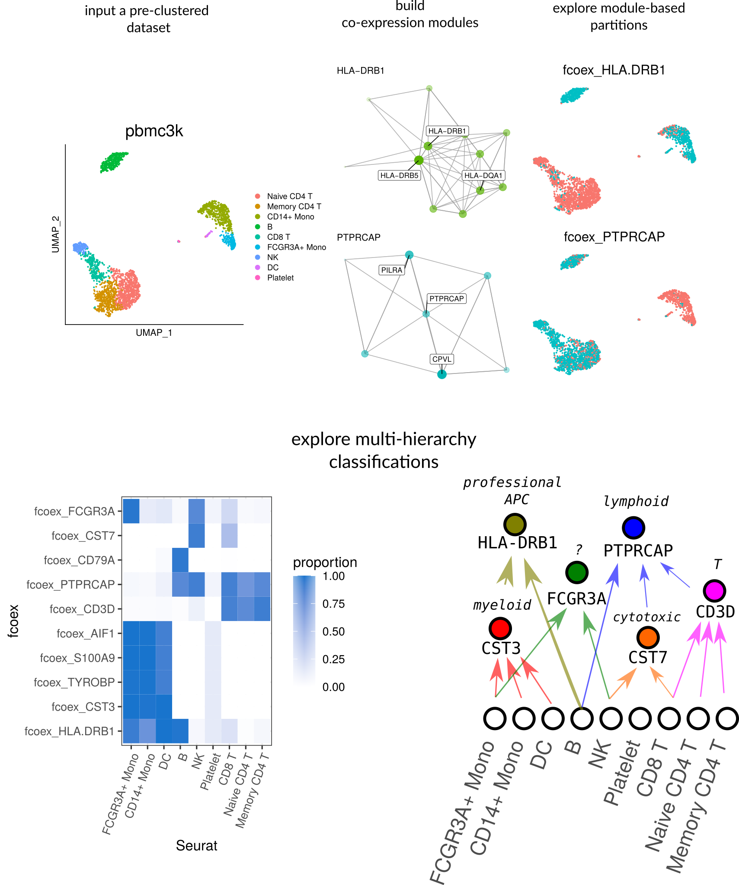

# Results

## The fcoex method 

The _fcoex_ tool was built from first principles to provide better understandability. Our first goal was to develop a smaller set of genes that globally captured the cellular diversity of a dataset. 

For that, we decided to explore feature selection by _symmetrical uncertainty_, the correlation metric of FCBF, a popular feature selection algorithm for machine learning (over 2700 Google Scholar citations) with little previous use in biomedical sciences (8 PubMed results for "FCBF" as of April 2021). 

Symmetrical uncertainty relies on entropy (in the information-theory sense), which relies on categories for calculation. Thus, we implemented a set of heuristics to binarize gene expressions (https://bioconductor.org/packages/release/bioc/html/FCBF.html) which can be accessed via the `fcoex::discretize()` function.  

As mutual information is a supervised method, `fcoex` also needs pre-made cluster assignments obtained after running a standard scRNA-seq clustering pipeline. Cluster assignments convey information about the relations between cells and help to guide feature selection. 

`Fcoex`, then, selects genes global markers, which might be specific to 1, 2, or more clusters; the common factor is that they provide information to tell clusters apart.

To find the coexpression-module, we inverted the FCBF redundancy removal algorithm as a heuristic to find redundant (co-expressed) gene expression patterns. (see Supplementary Methods for details).   

The gene coexpression modules yielded by the pipeline are small by design (10s of genes per module), so to facilitate manual exploration of the coexpression landscape.
Each module has one "header" gene, which expression pattern is most representative of the genes in the module. 

The ultimate goal of the _fcoex_ pipeline is not necessarily the modules but to find biologically relevant populations. 

Modules contain correlated and anti-correlated genes and thus might hold signatures for two different populations. 

Fcoex treats each module as a gene set to find cell populations. It then uses only the expression of genes in the module to re-classify the cells.

After projecting the pipelines, we intend to verify if the modules captured complimentary views on cell identities comparatively to the Seurat clustering pipeline.

{#fig:overview height=7in .white}

## fcoex recovers multi-hierarchy of blood types

 To validate the fcoex pipeline, we selected the well-known pbmc3k dataset from SeuratData, which contains around 2700 peripheral blood mononuclear cells (PBMC) with author-defined cluster labels. 

 The standard fcoex pipeline detected nine modules that capture different parts of the cellular diversity in the dataset.

 For example, module M8, containing cytotoxicity genes as PRF1 and GZMA, split the dataset into cytotoxic (NK and CD8) and non-cytotoxic cells.  M2 (CD3D) split the dataset clearly in T-cells and non-T-cells.  M5 (HLA-DRB1) grouped monocytes, B cells, and dendritic cells, all known antigen-presenting cells (APC) (https://www.ebi.ac.uk/ols/ontologies/cl/terms?obo_id=CL:0000145).

 In general, fcoex clusters combined biologically similar cell types of the original dataset. The clusterings, then, help to explore and classify upper cell classes by function. Even in that super well-studied dataset, `fcoex` provided a new light on the shared functionality of some NK cells and macrophages: they both markedly express the CD16-coding gene FCGR3A, whose product is a key player in Antibody-dependent cellular cytotoxicity (ADCC). Thus, a complete functional classification of cells might want to include an 'ADCC-performing cells" class. 