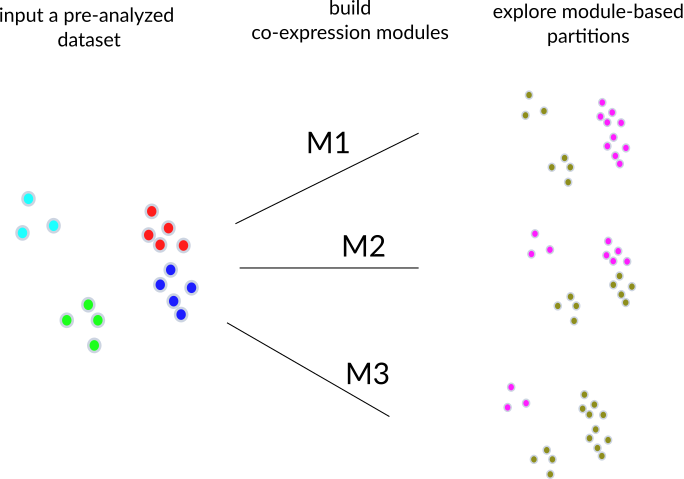

---
title: 'fcoex: using coexpression to explore cell type diversity in scRNA-seq data '
keywords:
- cell types
- coexpression
- fcoex
lang: en-US
date-meta: '2021-05-14'
author-meta:
- Tiago Lubiana
- Helder I Nakaya
header-includes: |-
  <!--
  Manubot generated metadata rendered from header-includes-template.html.
  Suggest improvements at https://github.com/manubot/manubot/blob/main/manubot/process/header-includes-template.html
  -->
  <meta name="dc.format" content="text/html" />
  <meta name="dc.title" content="fcoex: using coexpression to explore cell type diversity in scRNA-seq data " />
  <meta name="citation_title" content="fcoex: using coexpression to explore cell type diversity in scRNA-seq data " />
  <meta property="og:title" content="fcoex: using coexpression to explore cell type diversity in scRNA-seq data " />
  <meta property="twitter:title" content="fcoex: using coexpression to explore cell type diversity in scRNA-seq data " />
  <meta name="dc.date" content="2021-05-14" />
  <meta name="citation_publication_date" content="2021-05-14" />
  <meta name="dc.language" content="en-US" />
  <meta name="citation_language" content="en-US" />
  <meta name="dc.relation.ispartof" content="Manubot" />
  <meta name="dc.publisher" content="Manubot" />
  <meta name="citation_journal_title" content="Manubot" />
  <meta name="citation_technical_report_institution" content="Manubot" />
  <meta name="citation_author" content="Tiago Lubiana" />
  <meta name="citation_author_institution" content="Department of Clinical and Toxicological Analyses, School of Pharmaceutical Sciences, University of São Paulo, São Paulo, Brazil" />
  <meta name="citation_author_orcid" content="0000-0003-2473-2313" />
  <meta name="citation_author" content="Helder I Nakaya" />
  <meta name="citation_author_institution" content="Department of Clinical and Toxicological Analyses, School of Pharmaceutical Sciences, University of São Paulo, São Paulo, Brazil" />
  <meta name="citation_author_orcid" content="0000-0001-5297-9108" />
  <link rel="canonical" href="https://lubianat.github.io/fcoex_report/" />
  <meta property="og:url" content="https://lubianat.github.io/fcoex_report/" />
  <meta property="twitter:url" content="https://lubianat.github.io/fcoex_report/" />
  <meta name="citation_fulltext_html_url" content="https://lubianat.github.io/fcoex_report/" />
  <meta name="citation_pdf_url" content="https://lubianat.github.io/fcoex_report/manuscript.pdf" />
  <link rel="alternate" type="application/pdf" href="https://lubianat.github.io/fcoex_report/manuscript.pdf" />
  <link rel="alternate" type="text/html" href="https://lubianat.github.io/fcoex_report/v/bb7fe23800e47b5c9655760486c619015ef3647c/" />
  <meta name="manubot_html_url_versioned" content="https://lubianat.github.io/fcoex_report/v/bb7fe23800e47b5c9655760486c619015ef3647c/" />
  <meta name="manubot_pdf_url_versioned" content="https://lubianat.github.io/fcoex_report/v/bb7fe23800e47b5c9655760486c619015ef3647c/manuscript.pdf" />
  <meta property="og:type" content="article" />
  <meta property="twitter:card" content="summary_large_image" />
  <meta property="og:image" content="https://github.com/lubianat/fcoex_report/raw/bb7fe23800e47b5c9655760486c619015ef3647c/content/images/name.png" />
  <meta property="twitter:image" content="https://github.com/lubianat/fcoex_report/raw/bb7fe23800e47b5c9655760486c619015ef3647c/content/images/name.png" />
  <link rel="icon" type="image/png" sizes="192x192" href="https://manubot.org/favicon-192x192.png" />
  <link rel="mask-icon" href="https://manubot.org/safari-pinned-tab.svg" color="#ad1457" />
  <meta name="theme-color" content="#ad1457" />
  <!-- end Manubot generated metadata -->
bibliography:
- content/manual-references.json
manubot-output-bibliography: output/references.json
manubot-output-citekeys: output/citations.tsv
manubot-requests-cache-path: ci/cache/requests-cache
manubot-clear-requests-cache: false
...

<small><em>
This manuscript
([permalink](https://lubianat.github.io/fcoex_report/v/bb7fe23800e47b5c9655760486c619015ef3647c/))
was automatically generated
from [lubianat/fcoex_report@bb7fe23](https://github.com/lubianat/fcoex_report/tree/bb7fe23800e47b5c9655760486c619015ef3647c)
on May 14, 2021.
</em></small>

## Authors

+ **Tiago Lubiana** 
    {.inline_icon}
    [0000-0003-2473-2313](https://orcid.org/0000-0003-2473-2313)
    · {.inline_icon}
    [lubianat](https://github.com/lubianat) 
  <small>
     Department of Clinical and Toxicological Analyses, School of Pharmaceutical Sciences, University of São Paulo, São Paulo, Brazil
  </small>

+ **Helder I Nakaya** 
    {.inline_icon}
    [0000-0001-5297-9108](https://orcid.org/0000-0001-5297-9108) 
  <small>
     Department of Clinical and Toxicological Analyses, School of Pharmaceutical Sciences, University of São Paulo, São Paulo, Brazil
  </small>

## Abstract {.page_break_before}

# Introduction

Single-cell RNA sequencing (scRNA-seq) data analysis is at the core of the current quest to describe all human cell types. [@wikidata:Q46368626] The annotation of cell events in scRNA-seq is commonly done by clustering single cells and manually identifying cell types on the dataset. [@wikidata:Q64974172]:

Clusters (and their markers) are a prime tool for discovering new groupings with biological relevance. Fine-grained Louvain clustering can highlight out rare, uniform population like the newly identified airway ionocytes. [@wikidata:Q57318689]  [@wikidata:Q57318689] Complementarily, hierarchical clustering provides a multilevel perspective on cell identity, providing knowledge on upper cell classes, prone for ontology building[@wikidata:Q71306466])

While such methodologies are already powerful, we identified a gap: current works seldom explore the multi-hierarchy clustering. Biologists are used to tree-like; single-hierarchy classifications, such as the so-called tree-of-life. That tree-like structure rises as a natural side-effect of the macroevolutionary process of vertebrates, where species give rise to one (or more) others. Cell type classifications, however, are functional in essence[@wikidata:Q87649649] and, thus, do not need to be tree-like. In fact, formal ontologies of cell types (like the Cell Ontology) catalog many cell types with multiple direct parents. [@wikidata:Q21184168] [@wikidata:Q57318688]

We build fcoex, an R package that builds coexpression networks as an scaffold for multi-hierarchy classification of cell types, and describe its application to some datasets.

# Results

## The fcoex method 

The _fcoex_ tool was built from first principles to provide better understandability. Our first goal was to develop a smaller set of genes that globally captured the cellular diversity of a dataset. 

For that, we decided to explore feature selection by _symmetrical uncertainty_, the correlation metric of FCBF, a popular feature selection algorithm for machine learning (over 2700 Google Scholar citations) with little previous use in biomedical sciences (8 PubMed results for "FCBF" as of April 2021). 

Symmetrical uncertainty relies on entropy (in the information-theory sense), which relies on categories for calculation. Thus, we implemented a set of heuristics to binarize gene expressions (https://bioconductor.org/packages/release/bioc/html/FCBF.html) which can be accessed via the `fcoex::discretize()` function.  

As mutual information is a supervised method, `fcoex` also needs pre-made cluster assignments obtained after running a standard scRNA-seq clustering pipeline. Cluster assignments convey information about the relations between cells and help to guide feature selection. 

`Fcoex`, then, selects genes global markers, which might be specific to 1, 2, or more clusters; the common factor is that they provide information to tell clusters apart.

To find the coexpression-module, we inverted the FCBF redundancy removal algorithm as a heuristic to find redundant (co-expressed) gene expression patterns. (see Supplementary Methods for details).   

The gene coexpression modules yielded by the pipeline are small by design (10s of genes per module), so to facilitate manual exploration of the coexpression landscape.
Each module has one "header" gene, which expression pattern is most representative of the genes in the module. 

The ultimate goal of the _fcoex_ pipeline is not necessarily the modules but to find biologically relevant populations. 

Modules contain correlated and anti-correlated genes and thus might hold signatures for two different populations. 

Fcoex treats each module as a gene set to find cell populations. It then uses only the expression of genes in the module to re-classify the cells.

After projecting the pipelines, we intend to verify if the modules captured complimentary views on cell identities comparatively to the Seurat clustering pipeline.

{#fig:overview height=7in .white}

## fcoex recovers multi-hierarchy of blood types

 To validate the fcoex pipeline, we selected the well-known pbmc3k dataset from SeuratData, which contains around 2700 peripheral blood mononuclear cells (PBMC) with author-defined cluster labels. 

 The standard fcoex pipeline detected nine modules that capture different parts of the cellular diversity in the dataset.

 For example, module M8, containing cytotoxicity genes as PRF1 and GZMA, split the dataset into cytotoxic (NK and CD8) and non-cytotoxic cells.  M2 (CD3D) split the dataset clearly in T-cells and non-T-cells.  M5 (HLA-DRB1) grouped monocytes, B cells, and dendritic cells, all known antigen-presenting cells (APC) (https://www.ebi.ac.uk/ols/ontologies/cl/terms?obo_id=CL:0000145).

 In general, fcoex clusters combined biologically similar cell types of the original dataset. The clusterings, then, help to explore and classify upper cell classes by function. Even in that super well-studied dataset, `fcoex` provided a new light on the shared functionality of some NK cells and macrophages: they both markedly express the CD16-coding gene FCGR3A, whose product is a key player in Antibody-dependent cellular cytotoxicity (ADCC). Thus, a complete functional classification of cells might want to include an 'ADCC-performing cells" class. 

# Discussion 

Here we presented fcoex, a ready-to-use R/Bioconductor package for co-expression-based reclustering of single-cell RNA-seq data.
We note that other methods are increasingly available for co-expression analysis of single cells. The monocle R package [@wikidata:Q41861103], widely used for pseudotime analysis, has implemented algorithms for detecting co-expression modules (<https://cole-trapnell-lab.github.io/monocle3/docs/differential/#gene-modules>), and WGCNA, widely used in bulk transcriptomics, has also been applied to scRNA-seq [@wikidata:Q21284194] [@wikidata:Q62485122]. 

In principle, any of those algorithms could be used as input for our framework (and we provide code showing how to integrate them to `fcoex`). We note, though, that fcoex modules are generally smaller and provide module header genes, making it a sensible first-pass approach to explore the  multi-layered diversity in single-cell transcriptomics datasets. 
In that way, fcoex offers ways to explore data-driven classifications of cells, aligning itself with the challenges of the Human Cell Atlas and, specifically, of building ontologies of cell types in the single-cell era.

# Supplementary Methods 

## Preprocessing 

### pbmc3k dataset preprocessing 
__pbmc3k__ was loaded as a Seurat object from the SeuratData package. The expression matrix in the “data” slot and the labels in the “Idents” slot as input for creating the _fcoex_ object.

# Gene expression discretization 
As the original Fast Correlation-Based Filter [@wikidata:Q106704674] algorithm was constructed to deal with discrete data, we had to discretize gene counts. We chose as a discretization metric a min-max-percent approach. For each gene, we took the lowest and the highest normalized value across the cells. We set a threshold at 25% of the max-min range. All the values below this threshold were considered “OFF,” and all above was “ON”. 

# Identification of _fcoex_ modules 

## Filtering genes by correlation to labels 

After the discretization step, genes were ranked by their correlation to labels previously assigned by the Seurat Data team. The correlation metric we used was the nonlinear Symmetrical Uncertainty, a variation of mutual information that maps the values between 0 (worst) and 1 (best), and accounts for differences in entropy ranges that arise when variables have a different number of classes (number of labels and number of gene classes). All downstream steps were performed only with the previously filtered genes

## Building the coexpression network
Each module M is composed of one module seed (x) predominantly-correlated to the label (L) and all the genes (Yi) more correlated to the seed than to the label.
In practice, the algorithm builds an all x all correlation matrix by symmetrical uncetainty, the adjacency matrix of the co-expression network. This adjacency matrix is then trimmed, and edges between nodes Yi and Yj are removed from the network iff SU(Yi, Yj) < SU(Yi, L) or SU(Yi, Yj) < SU(Yj, L). 
Inferring coexpression modules
Modules were built in a bottom-up approach, first selecting genes predominantly correlated to the labels. These genes are the output of the Fast Correlation-Based Filter  (FCBF) algorithm for feature selection.
Each selected featured forms a new cluster, corresponding to all the genes associated to it in the trimmed network. The modules formed in that way are fuzzy, as a gene might belong to several modules. 

## Reclustering of cells
To recluster the cells based on each module, we use the “recluster” function of the _fcoex_ module. It uses the gene sets in each co-expression community to subset the expression table given originally as input. This reduced table contains the expression values regarding those genes for all the cells in the dataset.
The distances between cells in this reduced matrix was calculated by the manhattan distance, and hierarchical clustering was performed. The metric used to calculate the linkage distance between groups was the “ward.D2” metric as implemented in the hclust function of the stats package in R 3.6.1. Two groups of cells were retrieved from each  clustering (the k parameter was set to 2) .
## Code availability 
The _fcoex_ package, which performs the coexpression analysis is available at <http://bioconductor.org/packages/fcoex/>. The discretization and feature selection algorithms are available in a second package, FCBF (<http://bioconductor.org/packages/FCBF/>). All the analyses performed for this work are available at <https://github.com/lubianat/fcoex paper>. 

# Acknowledgments 
We would like to thank Pedro Russo, Gustavo Ferreira and Lucas Cardozo for contributions to software development, as well as all members of the Computational Systems Biology Laboratory for discussions and feedback. This work was supported by grants 2018/10257-2 and 2019/26284-1, São Paulo Research Foundation (FAPESP). 

## References {.page_break_before}

<!-- Explicitly insert bibliography here -->

